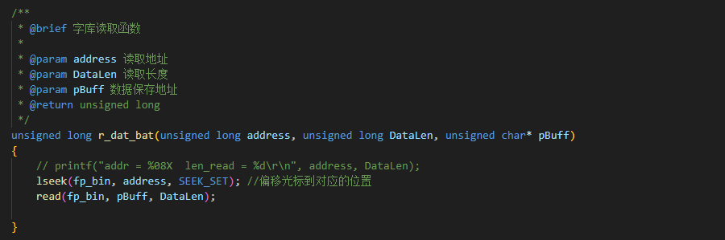

 

    

 

  <a><b>GT-HMI-Engine Linux Integration</b></a>

  <a><b>致力于低代码开发，多功能，易用的免费嵌入式图形库</b></a>

---

 

    <a href="https://www.hmi.gaotongfont.cn/kfgj"> 公司官网 </a> |
    <a href="https://space.bilibili.com/3493293474188211/video"> B 站教程 </a> |
    <a href="https://www.hmi.gaotongfont.cn/kfgj#/#hmiEngine"> Engine 使用手册 </a> |
    <a href="https://www.hmi.gaotongfont.cn/kfgj#/#hmidesigner"> Designer 使用手册 </a> |
    <a href="http://isite.baidu.com/site/wjz7qkrv/406a2b0c-f9c7-4a08-a47a-662e862b2af4?ch=48&wid=498ccd5c05334f21a2142ba3cf628964_0_0&field=&orderBy=&categoryId=undefined&title=%E8%81%94%E7%B3%BB%E6%88%91%E4%BB%AC"> 联系方式 </a> |
    <a href="https://genitop-1317577547.cos.ap-nanjing.myqcloud.com/GT-HMI/GT-HMI-Groups/GT-HMI%20Communication%20groups.jpg"> GT HMI微信交流群 </a>

 

### 一、介绍

        GT-HMI Engine 是一个免费且开源的嵌入式 GUI 引擎，使用 MIT 协议开源，方便用户自由使用和二次开发。该引擎具有丰富的模块化图形组件、高级图形引擎且支持多种显示设备；使用 C 编写，支持跨平台操作系统，易于移植使用。本工程采用GT-HMI-Engine(v1.3.0)，用做Linux移植。

### 二、目录结构

<table>
<tr>
  <th style="width:40%">目录</th>
  <th style="width:60%">说明</th>
</tr>
<tr>
  <td>GT-HMI-Engine/</td>
  <td>GT-HMI-Engine 下位机引擎</td>
</tr>
<tr>
  <td>GT-HMI-Engine/driver/</td>
  <td>GT-HMI-Engine 下位机引擎的驱动底层</td>
</tr>
<tr>
  <td>GT-HMI-Engine/src/</td>
  <td>GT-HMI-Engine 下位机引擎内的核相关代码</td>
</tr>
<tr>
  <td>GT-HMI-Engine/gt.h</td>
  <td>GT-HMI-Engine 下位机引擎头文件</td>
</tr>
<tr>
  <td>ui/</td>
  <td>GT-HMI-Engine上位机的UI工程</td>
</tr>
<tr>
  <td>gt_linux_lcd</td>
  <td>屏幕显示驱动</td>
</tr>
<tr>
  <td>gt_linux_touch</td>
  <td>屏幕触摸驱动</td>
</tr>
</table>

### 三、准备工作

- 准备好所用开发板的交叉编译环境

- 带LCD的Linux开发板，调通LCD和触摸驱动

- 下载GT-HMI-Engine源码： 
  gitee仓库：[GT-HMI-Engine 发行版 - Gitee.com](https://gitee.com/genitop/GT-HMI-Engine/releases/) 
  GitHub仓库：[GitHub - gaotongfont/GT-HMI-Engine: GT-HMI Engine code](https://github.com/gaotongfont/GT-HMI-Engine)

### 四、开始移植

**1. 创建工程**

- 创建gt_hmi_demo文件夹。

- 将调试好的LCD驱动、触摸驱动和main.c复制到gt_hmi_demo目录下，并写好Makefile文件。

- 在gt_hmi_demo目录下创建GT-HMI-Engine和UI文件夹。

- 解压GT-HMI-Engine-vxxx.zip，将driver、src和gt.h复制到GT-HMI-Engine目录下。

- 创建好的目录结构如下：

     

**2. 编译GT-HMI Designer上位机工程**

正常是编译自己用GT-HMI Designer上位机设计好的工程，本文使用的是示例中的10.1寸示例工程。

- 设置编译环境，开发板卡设置可以不用设置，字库配置如下所示，其中编译器gcc路径选择windows版的交叉编译器，要与Linux版的交叉编译器版本一致：

     

- 点击编译，如果未选择保存路径便会跳出弹窗，选择保存路径。
  
  

**3. 移植UI**

- 编译完成后，打开保存路径。将screen目录下的所有文件复制到gt_hmi_demo工程中的UI目录下。

- 用board目录下的gt_port_vf.c文件替换gt_hmi_demo/GT-HMI-Engine/driver/gt_port_vf.c文件。

- 将board目录下的gt_gui_driver.h和gt_gui_driver.a复制到gt_hmi_demo/GT-HMI-Engine/driver目录下，删除gt_gui_driver.c文件。
  
  

**4. 修改配置**

- 修改gt_hmi_demo/GT-HMI-Engine/src/gt_conf.h中的屏幕宽高设置，其他配置可根据实际需要进行修改。
    
  如果控件较多，可适当加大GT_MEM_SIZE的大小。 
   

- 修改gt_hmi_demo/UI/gt_ui.h，确定gt.h的相对路径无误。 
   

- 修改gt_conf_widgets.h中的配置，本工程没有使用一维码、二维码和输入法功能，需要将其关闭，不然编译时会报错。如果需要使用用这些功能，请确保打开相应地配置。
  
  

- 修改Makefile文件，将GT-HMI-Engine目录和UI目录下的文件添加到编译中。
    
  在Makefile文件中添加c99的编译规则、pthread线程函数的库和字库的gt_gui_driver.a文件。
   
  
  

**5. 实现回调函数和外部引用函数**

- _flush_cb刷屏函数(声明在gt_port_disp.c中)，示例如下。
    
  示例中调用的display_interface函数如下所示：
   

- read_cb触摸函数(声明在gt_port_indev.c中)，示例如下：
    
  在此函数中，判断有无触摸事件发生，如果没有发生则返回，如果发生触摸函数则将触摸点的 x 坐标和 y 坐标传入 data 结构体的 point.x 和 point.y，并将 state 设置为GT_INDEV_STATE_PRESSED 即可。其余的实现方式只需要测试触摸屏幕时，能否读取到正确的触摸状态和对应的 x y 坐标均可。

- read_cb_btn按键函数(声明在gt_port_indev.c中)，此函数与读触摸函数类似,需要实现读取按键的函数。如果有按键被按下则将 data->state
  设置为 GT_INDEV_STATE_PRESSED，同时将 btn_id 设置为按键键值。(本工程中没有实体按键，可以为空。)
   

- spi_wr函数(声明在gt_port_vf.c中)
   

- 心跳函数gt_tick_inc(1)(此函数声明在gt_hal_tick.h中)，实现一个心跳函数gt_tick_inc(1)，保证GUI持续运行。
    
  在main函数中激活心跳函数的线程，并在while循环中加入GUI的事务处理函数gt_task_handler使其每1ms循环执行一次。
   

- 实现字库读取函数r_dat_bat()和gt_read_data()(函数声明在gt_gui_driver.h中)，示例如下：
    
  这里没有发送的需要，gt_read_data()可以为空。 
   

**6. 编译、运行**

- 在main函数中打开图片资源文件，用make命令编译成可执行文件。
   

- 使用SecureCRT工具连接开发板，连接设置如下： 
   

- 将编译后的可执行文件和GT-HMI Designer上位机工程中的board/resource.bin文件复制到开发板上。注意，这里的resource.bin文件的路径必须要与main函数中打开图片资源文件的路径一致。这里是先将文件复制到U盘，再使用mount /dev/sda1 /mnt命令挂载U盘，然后复制文件到开发板上，最后运行可执行文件。
  
  
